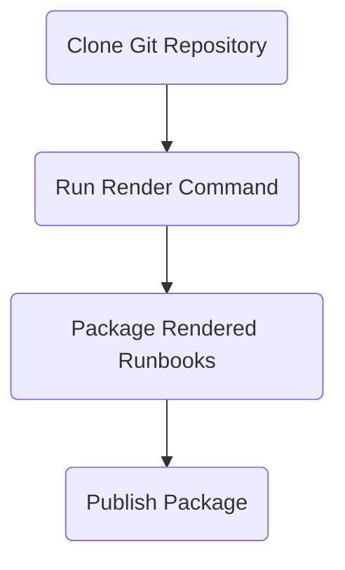

# Runbook Compiler

The program is divided into namespaces similar to AspNetCore. Each
namespace pretty much means what you think it does.

 * Commands - commands execute functionality of the CLI.
 * Models - defines objects to be serialize/deserialized.
 * Services - functionality shared across commands.

# Commands

The command classes are executed by the Spectre Console library. They
have their dependent services injected at runtime. Each command should
validate the parameters that were passed in the settings class then
call the appropriate service methods to complete the command
functionality.

# Services

The service classes are exposed using an interface. This deciding
factor for a service implementation is the reuse of functionality
across command classes.  Using in interface is allows for mocking
during unit tests.

The service interfaces are generally injected into the commands to
supply the defined functionality.

# Logging Strategy

All classes using the `ILogger` from the Microsoft logging
abstractions package.  All command level logging will be done using
`LogInformation`. All technology related logging for protocols, IO,
etc. will be logged using `LogDebug`. If an exception is encountered
then it can be logged using `LogError`.
